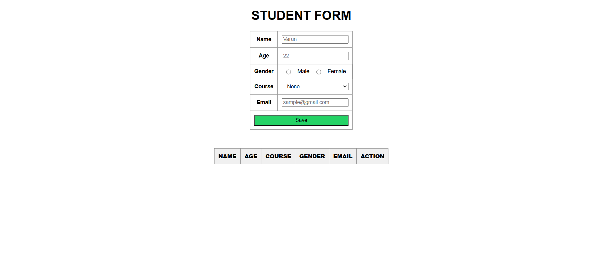
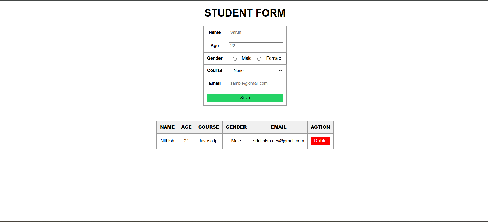

# 🎓 Student Form Project

A simple **Student Management Form** built with **HTML, CSS, and JavaScript**.  
This project allows users to input student details via a form and display them in a table with the ability to delete entries.

---

## 🔗 Live Demo  
👉 [Visit Student details form](https://srinithish-dev-lab.github.io/Student-Details-Form/)  

## 📂 Repository  
👉 [GitHub Repo](https://github.com/Srinithish-dev-lab/Student-Details-Form)  

---

## 🚀 Features
- 📌 Add new students with details:
  - Name
  - Age
  - Gender
  - Course
  - Email
- 📋 Dynamically adds data into a table.
- 🗑️ Delete student records with one click.
- 🎨 Clean and responsive UI with styled table and buttons.
- ✅ Automatic form reset after saving.

---

## 🛠️ Tech Stack
- **HTML5** – for structure  
- **CSS3** – for styling and layout  
- **JavaScript (Vanilla JS)** – for DOM manipulation & form handling  

---

## 📸 Screenshots

### 🏠 Home Page

